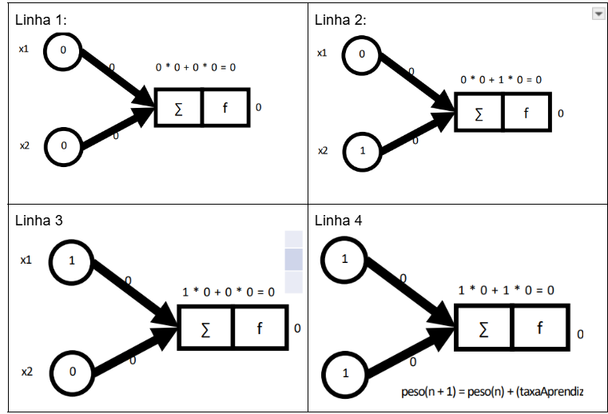

## Problema Linearmente Separável (OPERADOR AND)

### Operador AND


### Modelo do perceptron


### Passo a passo da aplicação da função soma e calculo da step function



### Ajuste dos pesos


### Passo a passo da aplicação da função soma e calculo da step function após o treinamento


## Explicação do Código do Perceptron de Uma Camada

## Importação de Bibliotecas

```python
import tensorflow as tf
import numpy as np
```

## Definição dos dados de entrada e saída (nesse caso, operação AND)

```python
X = np.array([[0.0, 0.0],
             [0.0, 1.0],
             [1.0, 0.0],
             [1.0, 1.0]])

y = np.array([[0.0], [0.0], [0.0], [1.0]]) # resultado esperado da operação
```

<P>X: Matriz de entradas representando todas as combinações possíveis de uma porta lógica AND (2 entradas binárias).

y: Saídas esperadas correspondentes à operação AND (1 apenas quando ambas entradas são 1).</P>

## Inicialização dos Pesos

```python
qtd_linhas = 2
qtd_colunas = 1
w = tf.Variable(tf.zeros([qtd_linhas,qtd_colunas], dtype = tf.float64)) # pesos

[[0.]
 [0.]]
```

<p>
Cria uma variável do TensorFlow para os pesos, inicializada com zeros.

Tem dimensão 2x1 (um peso para cada entrada).

No perceptron, cada peso é associado a cada entrada

</p>

## Cálculo da Camada de Saída

```python
camada_saida = tf.matmul(X, w)

[[0.]
 [0.]
 [0.]
 [0.]]
```

<p>
Calcula a saída linear do perceptron (multiplicação matricial entre entradas e pesos). 
</p>

## Função de Ativação

```python
def step(x):
    return tf.cast(tf.to_float(tf.math.greater_equal(x, 1)), tf.float64)
```

<p>
Define a função degrau (step function) como função de ativação:

Retorna 1.0 se x ≥ 1

Retorna 0.0 caso contrário

O tf.cast garante que o resultado seja do tipo float64.

</p>

## Aplicação da Função de Ativação

```python
camada_saida_ativacao = step(camada_saida)

[[0.]
 [0.]
 [0.]
 [0.]]
```

<p>
Para cada valor resultante da multiplicação entre a entrada e seu peso, aplica a função degrau
</p>

## Cálculo do Erro

```python
erro = tf.subtract(y, camada_saida_ativacao)
```

<p>
subtrai cada valor esperado pelo valor da camada de saida:
0 - 0 = 0 acerto
0 - 0 = 0 acerto
0 - 0 = 0 acerto
1 - 0 = 1 Erro
acurácia: 75%
objetivo: chegar a 0 para todas as subtrações
</p>

## Atualização dos Pesos (Regra Delta)

```python
delta = tf.matmul(X, erro, transpose_a = True)
treinamento = tf.assign(w, tf.add(w, tf.multiply(delta, 0.1)))
```

<p>
delta: Calcula o gradiente (transposta de X multiplicada pelo erro)

treinamento: Atualiza os pesos usando a regra delta com taxa de aprendizado 0.1:

w = w + η _ Xᵀ _ erro

</p>

## Treinamento do Perceptron

```python
with tf.Session() as sess:
    sess.run(init)
    epoca = 0
    for i in range(15):
        epoca += 1
        erro_total, _ = sess.run([erro, treinamento])
        erro_soma = tf.reduce_sum(erro_total)
        print(erro_total)
        print('Epoca: ', epoca, "Erro: ", sess.run(erro_soma))
        if erro_soma.eval() == 0.0:
            break
    w_final = sess.run(w)

# saída:
1.0
Epoca:  1 Erro:  1.0
1.0
Epoca:  2 Erro:  1.0
1.0
Epoca:  3 Erro:  1.0
1.0
Epoca:  4 Erro:  1.0
1.0
Epoca:  5 Erro:  1.0
0.0
Epoca:  6 Erro:  0.0
```

<p>
- Define o numero de epocas (quantas vezes o treinamento será realizado até obter o menor erro esperado).
- Aplica novamente o cálculo do erro em erro_soma
- O valor dos pesos é atualizado na execução do treinamento
</p>
